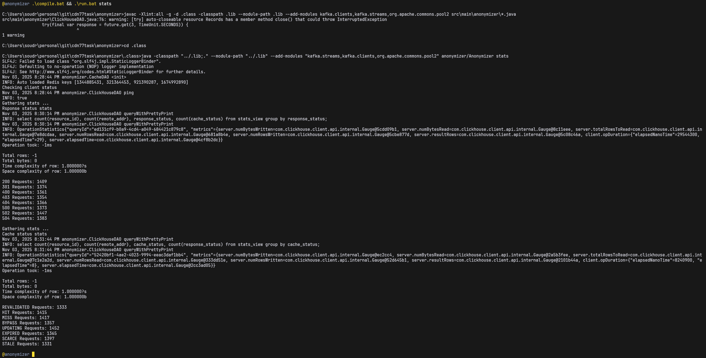
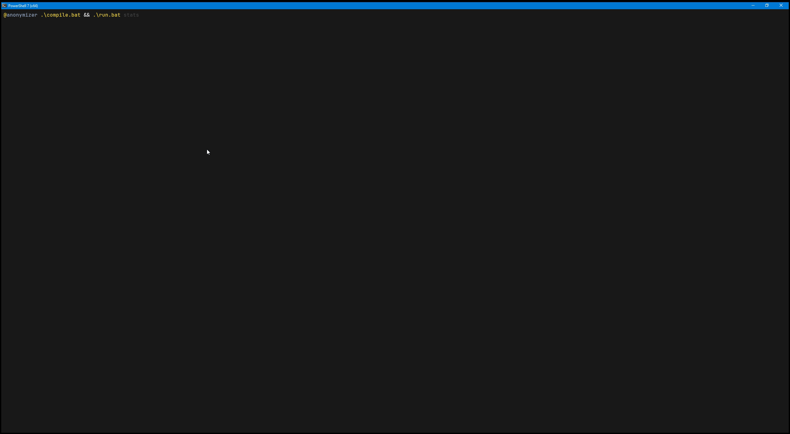
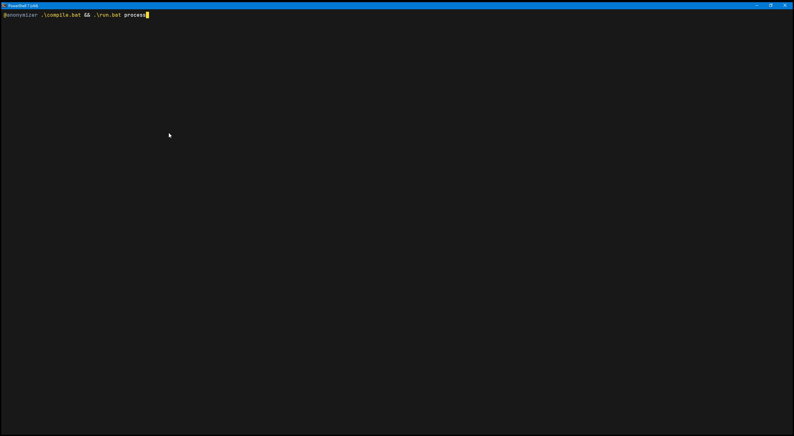

### Build instructions

### Build scripts
This project contains build scripts for building, and running the program (inspired by make / Cmake)

*I highly recommend to read EVERY script BEFORE running it, and running only AFTER gaining a GOOD understanding of ALL of the steps peroformed*

The scripts are:
- [compile.bat](./compile.bat) compiles the program for the Windows NT platform
- [run.bat](./run.bat) runs the program on the Windows NT platform
- [doc.bat](./doc.bat) compiles the javadocs on the Windows NT plarform

*All of the aforementioned scripts should also run on other platforms (e.g. use bash instead, adn replace file separators)*

### Project structure
No build system like Apache Maven, or Gradle, etc. is used, for simplicity.

Most important files, and directories / folders:
- [src](./src) is the classic Java source code directory
- [.lib](./.bin) should contain any binary / executable files (e.g. the Kafka Consumer client)
- [.lib](./.lib) should contain eny external libraries used for compilation, and running of the project (jars)
- [.doc](./.doc) should contain javadoc output
- [.class](./.class) should be used as javac output folder for bytecode .class files

### How can I build / run the program (Windows NT)?

Prerequisities:
- Have Docker, and Docker daemon installed on your system
- Have Java installed, and properly setup on your system (javac, java, javadoc, etc.)
- Your system must have sufficient resources

Building:
1. Clone this repository to your system, or download the source directory
2. Change working directory to the root directory of this project (anonymizer/)
3. Create a .class directory
4. Make sure your current working directory is at the level of the compile.bat build script
5. Run `.\compile.bat`

Running:
1. Make sure your working directory is at the level of the run.bat script
2. Run `.\run.bat`

Generating javadoc: (!!!!Warning the output will be put into the current working directory!!!!)
1. Make sure your working directory is at the level of the run.bat script
2. Run `.\doc.bat`

### Controls

```
Anonymizer usage:

run.bat <OPTION>|<process|stats>

ARGUMENTS:
process start processing Kafka data
stats display ClickHouse statistics

OPTION:
--help displays this message
--version prints version and exits
```

### Dependencies

Please see the contents of [.lib](./.lib)

### Program showcase






